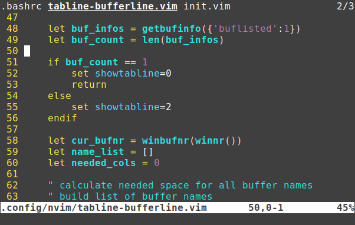

# vim-tabline-bufferline
Plain and simple tabline buffer list display and navigation for Vim and Neovim



If there is not enough space, the names will be shorten with ellipsis. There is no scrolling of the buffer line.


# Installation
Copy the file `tabline-bufferline.vim` into the folder `.vim` or `.config/nvim` of your home directory and add the following line add the beginning of your `.vimrc` or `.config/nvim/init.vim` configuration file.

```vim
runtime tabline-bufferline.vim
```

# Configuration
Edit the following lines to match your usage of Vim or Neovim.

```vim
" remove terminal from buffer list
" neovim
"autocmd TermOpen * call setbufvar(bufnr('%'), '&buflisted', 0)
" vim
autocmd TerminalOpen * call setbufvar(bufnr('%'), '&buflisted', 0)
```

Edit the following lines to adjust or remove the key bindings for buffer switching.

```vim
" buffer navigation with Ctrl+Cursor
" gnome-terminal
"noremap <C-Up> <Nop>
"noremap <C-Down> <Nop>
"noremap <C-Left> <Cmd>bprev<CR>
"noremap <C-Right> <Cmd>bnext<CR>
" xterm, rxvt
noremap <Esc>Oa <Nop>
noremap <Esc>Ob <Nop>
noremap <Esc>Od <Cmd>bprev<CR>
noremap <Esc>Oc <Cmd>bnext<CR>
```

Edit the following lines to adjust the highlight of the tabline.

```vim
" use normal background color for tabline
highlight TabLineFill NONE
" normal buffer names
highlight User1 NONE
" current buffer name
highlight User2 term=bold,underline cterm=bold,underline gui=bold,underline
```

Edit the follwing line to change the separator. Default is a single white space, but you can also specify multiple chars.

```vim
" separator
const s:SEP = ' '
```
